# 🔒 InsightVault

InsightVault turns your clipboard into a structured, AI-powered database of your personal notes. It uses the Claude Agent SDK to listen for text you copy while browsing or reading and automatically tags, stores, and organizes it into a private vault. When you're done, it publishes a formatted report to Confluence with a single command. It is a functional demonstration of how to build real-world tools using the Claude Agent SDK. It showcases a "headless" agentic workflow where Claude is taught custom skills to bridge the gap between a local environment and cloud services like Supabase and Confluence.

---

### 💡 Core Philosophy

| Design Choice | Why It Matters |
|---------------|----------------|
| **"Preservation" priority** | Raw data integrity > AI polish. When learning, you want the original — not a paraphrase. |
| **"No Summarization"** | Keeps Claude token usage minimal — no analysis overhead. Capture first, synthesize later. |
| **"Ultra-Low Tokens"** | Cost-efficient for a background tool. Move to action |

> *We don't need to summarize everything every time. We need to preserve while reading and learning.*

---

## 🧠 How It Works

```mermaid
sequenceDiagram
    participant User
    participant Clipboard
    participant InsightVault
    participant Claude
    participant Supabase
    participant Confluence

    User->>Clipboard: Ctrl+C on any text
    Clipboard->>InsightVault: Detects change
    InsightVault->>Claude: "Save this under topic X"
    Claude->>Supabase: INSERT into reading_notes
    Supabase-->>User: "Vault Updated 🔒"
    
    User->>InsightVault: "I am done"
    InsightVault->>Claude: "Publish topic X"
    Claude->>Supabase: SELECT notes for topic X
    Claude->>Confluence: Create/Update page
    Confluence-->>User: 🚀 Page URL
```



### The Workflow

1. **Lock a Topic**: Tell the vault what you're researching → `/topic Agentic AI`
2. **Browse & Copy**: Highlight text anywhere and press `Ctrl+C`
3. **Auto-Capture**: Claude saves it to Supabase in the background
4. **Publish**: Type `I am done` → Get a Confluence page with all your notes

---

## 📂 Architecture

```
insight-vault/
├── run_agent.py                          # SDK orchestrator + clipboard listener
├── .claude/
│   └── skills/
│       └── capture-insight/
│           ├── SKILL.md                  # Natural language skill definition
│           ├── supabase_client.py        # Database operations tool
│           └── confluence_client.py      # Publishing tool
├── requirements.txt
└── .env                                  # Your credentials (not in repo)
```

### Component Breakdown

| Component | Lines | Purpose |
|-----------|-------|---------|
| `run_agent.py` | 159 | Async clipboard monitoring + user commands |
| `SKILL.md` | 31 | **The brain** — teaches Claude when/how to act |
| `supabase_client.py` | 68 | Insert notes, list topics |
| `confluence_client.py` | 72 | Create/update research pages |

---

## 🎯 The Skill Definition (The Magic)

The `SKILL.md` file is where Claude learns behavior:

```markdown
## Minimal Processing
* **No Summarization**: Do not summarize or alter the user's text. 
* **Topic Assignment**: Use the current session topic. Default to "General Research".

## Direct Storage (Supabase)
* **Immediate Action**: Call `insert_row` into the `reading_notes` table immediately.
* **Confirmation**: Print only: "Vault Updated 🔒 [{topic}]".

## Raw Export (Confluence)
* **Trigger**: Activate only on "I am done" or "Publish research".
* **Aggregation**: Query notes matching the specific topic.
* **Publish**: Use `create_page` to post to Confluence.

## Constraints
* **Ultra-Low Tokens**: Move directly to tool execution.
* **Preservation**: The integrity of the original snippet is the priority.
```

---

## 🛠️ Setup Guide (5 Minutes)

### Prerequisites

- Python 3.10+
- Node.js (LTS)
- Claude Code CLI: `npm install -g @anthropic-ai/claude-code`
- A Supabase project
- A Confluence space (Atlassian Cloud)

### 1. Clone & Install

```bash
git clone https://github.com/your-username/insight-vault.git
cd insight-vault

# Create virtual environment
python -m venv venv

# Activate it
# Windows:
.\venv\Scripts\activate
# Mac/Linux:
source venv/bin/activate

# Install dependencies
pip install -r requirements.txt
```

### 2. Create Supabase Table

Run this SQL in your Supabase SQL Editor:

```sql
CREATE TABLE reading_notes (
  id SERIAL PRIMARY KEY,
  content TEXT NOT NULL,
  topic VARCHAR(255) DEFAULT 'General Research',
  insight_tag VARCHAR(255) DEFAULT 'Raw Note',
  created_at TIMESTAMP WITH TIME ZONE DEFAULT NOW()
);
```

### 3. Configure Environment

Create a `.env` file in the root folder:

```env
# --- DATABASE (Supabase) ---
SUPABASE_URL=https://your-project.supabase.co
SUPABASE_SERVICE_ROLE_KEY=your-service-role-key

# --- DOCUMENTATION (Confluence/Atlassian) ---
ATLASSIAN_SITE_NAME=your-site-name
ATLASSIAN_USER_EMAIL=your-email@example.com
ATLASSIAN_API_TOKEN=your-atlassian-api-token

# --- AGENT CONFIGURATION ---
# Windows: Full path to claude.cmd
CLAUDE_CLI_PATH=C:\Users\YOUR_USERNAME\AppData\Roaming\npm\claude.cmd
# Mac/Linux: Just use 'claude'
# CLAUDE_CLI_PATH=claude
```

### 4. Run

```bash
python run_agent.py
```

---

## 📖 Commands

| Command | Action |
|---------|--------|
| `/topic <name>` or `/ <name>` | Switch research topic |
| `/list` | Show all topics in your vault |
| `I am done` or `Publish` | Publish current topic to Confluence |
| `Ctrl+C` (on any text) | Auto-capture to current topic |

---

## 🔑 Key Design Patterns Demonstrated

### 1. Claude as Orchestrator
```python
# No if/else routing logic — Claude decides based on SKILL.md
await client.query(query_text)
```

### 2. Async Dual-Loop Architecture
```python
await asyncio.gather(
    clipboard_listener(client),  # Background: watches clipboard
    user_input_loop(client)       # Foreground: handles commands
)
```

### 3. Topic Lock Pattern
```python
# Prepend context to every query — Claude categorizes automatically
query_text = f"TOPIC: {current_topic} | Raw capture: '{clip}'. Save as-is."
```

### 4. Tool Output Contract
```python
# Clean JSON for Claude to parse
print(json.dumps({"success": True, "data": result.data}))
# Errors to stderr
print(json.dumps({"success": False, "error": str(e)}), file=sys.stderr)
```

---

## 🤝 Contributions Welcomed

Contributions are welcome! Feel free to:
- Add new skills (e.g., export to other tools and platforms)
- Improve error handling
- Add a Streamlit UI (dependency already included)

---

